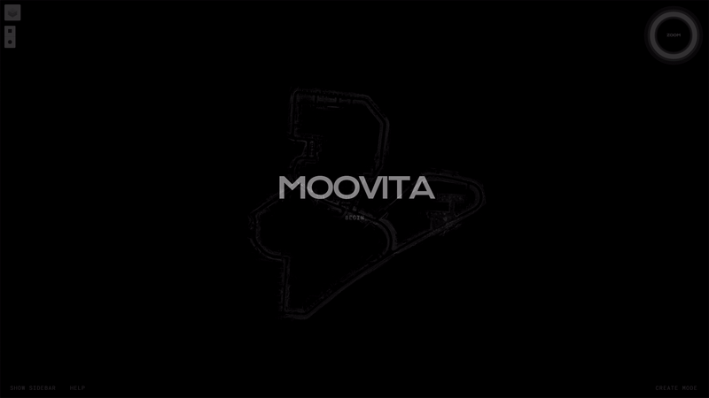

# moomapp-frontend

This is my very first web app/site.

> **Note**: This is a showcase demo I built to familiarise myself with the Vue framework and not the actual deployed application for MooVita.

<div align="center">
	
</div>

## Project setup

```
npm install
```

### Compiles and hot-reloads for development

```
npm run serve
```

### Compiles and minifies for production

```
npm run build
```

### Lints and fixes files

```
npm run lint
```

### Customize configuration

See [Configuration Reference](https://cli.vuejs.org/config/).
